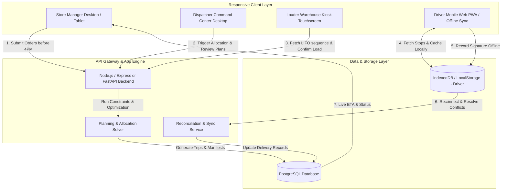

# System Architecture & Component Diagram

**Platform:** Waypoint Intelligent Logistics Network  
**Team:** CodeCrew  

---

## 1. High-Level Architecture

The Waypoint platform is structured as a modern modular web application that connects all 4 key logistics personas in real time:

---

## 2. Key Subsystems

1. **Order Capture & Cutoff Service:**
   - Enforces 4:00 PM cutoff rule. Late orders are tagged for Trip 2 / next day run.
2. **Planning & Allocation Engine:**
   - Assigns orders to vehicles and trips respecting constraints:
     - Weight and volume caps (`vehicles.csv`).
     - Ambient vs. Chilled goods isolation.
     - Access restrictions (van-only outlets e.g. `OUT077` vs truck access).
     - Maximum 2 trips per vehicle per day.
     - Fresh delivery window (< 08:00 AM).
3. **Loader Kiosk:**
   - Inverts delivery stop sequence to generate reverse LIFO loading order.
4. **Offline Driver Sync Engine (Graceful Degradation):**
   - Implements local mutation queue in browser IndexedDB / localStorage.
   - Detects signal drop in hill-country dead zones (Kandy corridor).
   - Prompts side-by-side reconciliation on reconnect (reconciling local records with dispatch route changes).
